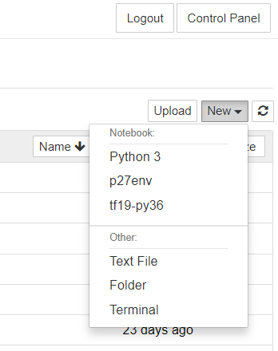

## User-defined kernels

The standard kernels in our JupyterHub setup include Python 3.6 and R 3.6.3,
both with only few packages installed. These are sufficient for demonstration
purposes, but may not contain specific packages that you may require. As a
solution, you may set up your own kernel based on one of your local environments.

We will illustrate this process for a MiniConda-installed Python environment.
Please consult the [VscDocumentation page on Python package management](
docs.vscentrum.be/en/latest/software/python_package_management.html) for
MiniConda installation instructions.

### Environment creation

We will create a MiniConda environment with the following Python packages:

- `python 2.7`
- `numpy`
- `scipy`
- `mayavi`
- `matplotlib`
- `pandas`
- `pandas`
- `tensorflow`
- `seaborn`

> **_NOTE:_** Instead of creating a new environment you can also introduce
  an existing environment to your JupyterHub. In this case you can skip the
  creation of the environment.


1. Create a new Conda environment (here named `p27env`):
   ```
   conda create -n p27env python=2.7 numpy scipy mayavi matplotlib pandas tensorflow seaborn
   ```

2. Activate the environment:
   ```
   conda activate p27env
   ```

3. Install the associated IPython kernel in ``${VSC_HOME}/.local`` so that
   JupyterHub can find it:
   ```
   python -m ipykernel install  --prefix=${VSC_HOME}/.local/ --name 'p27env'

4. Connect to JupyerHub and verify that the new 'p27env' kernel appears.
   It should look like this: 

5. Test the environment and make sure that it works as expected.
